# Testcontainers Demo

A microservices demo application showcasing integration testing with Testcontainers, featuring Spring Boot services
with PostgreSQL, Redis, Kafka, and MailHog.

## Architecture

```mermaid
graph TB
    Client[Client] -->|HTTP POST /users| UserService[User Service]
    Client -->|HTTP GET /users| UserService
    UserService -->|Check Rate Limit| LimiterService[Limiter Service]
    UserService -->|Save User| PostgreSQL[(PostgreSQL)]
    UserService -->|Publish Event| Kafka[Kafka]
    LimiterService -->|Rate Limiting| Redis[(Redis)]
    Kafka -->|UserCreatedEvent| NotificationService[Notification Service]
    NotificationService -->|Send Email| MailHog[MailHog]

    subgraph "User Service"
        UserService
        PostgreSQL
    end

    subgraph "Limiter Service"
        LimiterService
        Redis
    end

    subgraph "Notification Service"
        NotificationService
        MailHog
    end

    style UserService fill: #4CAF50
    style LimiterService fill: #2196F3
    style NotificationService fill: #FF9800
    style PostgreSQL fill: #336791
    style Redis fill: #DC382D
    style Kafka fill: #231F20
    style MailHog fill: #9C27B0
```



## Services

### User Service

- **Technology**: Spring Boot, PostgreSQL
- **Endpoints**:
    - `GET /users` - Retrieve all users
    - `POST /users` - Create a new user (rate-limited)
- **Features**:
    - User CRUD operations
    - Integration with Limiter Service for rate limiting
    - Publishes `UserCreatedEvent` to Kafka when a user is created

### Limiter Service

- **Technology**: Spring Boot, Redis
- **Endpoints**:
    - `POST /limits/{ipAddress}` - Check and increment rate limit for an IP address
- **Features**:
    - IP-based rate limiting using Redis
    - Returns `429 Too Many Requests` when limit is exceeded

### Notification Service

- **Technology**: Spring Boot, Kafka, MailHog
- **Features**:
    - Consumes `UserCreatedEvent` from Kafka
    - Sends welcome emails to newly registered users via MailHog

### Shared Module

- Contains common event definitions (`UserCreatedEvent`)
- Shared across all services

## Technologies

- **Java 25**
- **Spring Boot 4.0.0**
- **PostgreSQL** - User data persistence
- **Redis** - Rate limiting storage
- **Apache Kafka** - Event streaming
- **MailHog** - Email testing
- **Testcontainers** - Integration testing with real dependencies
- **Maven** - Build and dependency management

## Getting Started

### Prerequisites

- Java 25
- Docker (for running services and Testcontainers)
- Maven

### Running with Docker Compose

Start all infrastructure services:

```bash
docker-compose up -d
```

This will start:

- PostgreSQL on port 5432
- Redis on port 6379
- Kafka on port 9092
- MailHog on ports 1025 (SMTP) and 8025 (Web UI)

### Building the Project

```bash
./mvnw clean install
```

### Running Services

Start each service individually:

```bash
# User Service
cd user-service
./mvnw spring-boot:run

# Limiter Service
cd limiter-service
./mvnw spring-boot:run

# Notification Service
cd notification-service
./mvnw spring-boot:run
```

### Publishing events to Kafka

```bash
docker exec -it 62d392b598c8 /opt/kafka/bin/kafka-console-producer.sh --bootstrap-server localhost:9093 --topic user-created-topic --property parse.headers=true --property headers.delimiter=@
```

```plaintext
__TypeId__:com.github.corke123.shared.event.UserCreatedEvent@{"id": "550e8400-e29b-41d4-a716-446655440000", "firstName": "Marko", "lastName": "Markovic", "email": "marko@mail.com"}
```

### Consuming events from Kafka

```bash
docker exec -it 8319f2d9f814 /opt/kafka/bin/kafka-console-consumer.sh --bootstrap-server localhost:9093 --topic user-created-topic --from-beginning
```

## Testing

The project includes integration tests using Testcontainers, which automatically spin up real instances of PostgreSQL,
Redis, Kafka, and MailHog for testing.

Run all tests:

```bash
./mvnw test
```

## Flow Example

1. Client sends a POST request to `/users` in User Service
2. User Service calls Limiter Service to check IP rate limit
3. If allowed, User Service saves the user to PostgreSQL
4. User Service publishes a `UserCreatedEvent` to Kafka
5. Notification Service consumes the event from Kafka
6. Notification Service sends a welcome email via MailHog

## Monitoring

- **MailHog UI**: http://localhost:8025 - View sent emails

## Project Structure

```
testcontainers-demo/
├── user-service/          # User management service
├── limiter-service/       # Rate limiting service
├── notification-service/  # Email notification service
├── shared/               # Shared events and models
├── docker-compose.yaml   # Infrastructure services
└── pom.xml              # Parent POM
```
